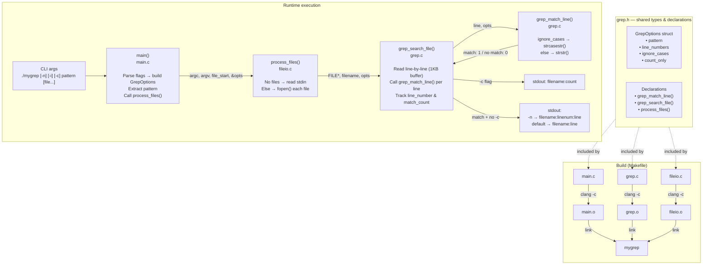

# mygrep — Flow Diagram

```mermaid
flowchart TD
    subgraph Build["Build (Makefile)"]
        MC[main.c] -->|clang -c| MO[main.o]
        GC[grep.c] -->|clang -c| GO[grep.o]
        FC[fileio.c] -->|clang -c| FO[fileio.o]
        MO & GO & FO -->|link| EXE[mygrep]
    end

    subgraph Header["grep.h — shared types & declarations"]
        GrepOptions["GrepOptions struct\n• pattern\n• line_numbers\n• ignore_cases\n• count_only"]
        Decls["Declarations\n• grep_match_line()\n• grep_search_file()\n• process_files()"]
    end

    subgraph Runtime["Runtime execution"]
        CLI["CLI args\n./mygrep [-n] [-i] [-c] pattern [file...]"]
        CLI --> main["main()\nmain.c\n\nParse flags → build GrepOptions\nExtract pattern\nCall process_files()"]

        main -->|"argc, argv, file_start, &opts"| process_files["process_files()\nfileio.c\n\nNo files → read stdin\nElse → fopen() each file"]

        process_files -->|"FILE*, filename, opts"| grep_search_file["grep_search_file()\ngrep.c\n\nRead line-by-line (1KB buffer)\nCall grep_match_line() per line\nTrack line_number & match_count"]

        grep_search_file -->|"line, opts"| grep_match_line["grep_match_line()\ngrep.c\n\nignore_cases → strcasestr()\nelse → strstr()"]

        grep_match_line -->|"match: 1 / no match: 0"| grep_search_file

        grep_search_file -->|"-c flag"| count_out["stdout: filename:count"]
        grep_search_file -->|"match + no -c"| line_out["stdout:\n-n → filename:linenum:line\ndefault → filename:line"]
    end

    Header -.->|included by| MC & GC & FC
```
