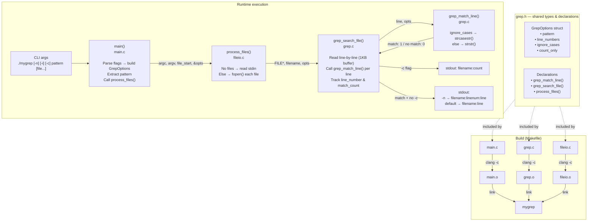

# mygrep — Flow Diagram



# mygrep

A handwritten implementation of the classic Unix `grep` tool, written in C as a learning project.

## What it does

`mygrep` searches for a text pattern inside one or more files (or standard input) and prints every line that contains a match — just like the real `grep`. It supports case-insensitive search, line number display, and match counting.

## Project structure

```
mygrep/
├── main.c      — entry point, argument parsing, flag handling
├── grep.c      — core matching logic (grep_match_line, grep_search_file)
├── fileio.c    — opens files and feeds them to the search engine
├── grep.h      — shared types and function declarations
└── Makefile    — build system
```

## Build

Requires `clang` and `make`.

```bash
make
```

This produces the `mygrep` binary in the current directory. The build includes AddressSanitizer (`-fsanitize=address`) so memory errors are caught at runtime during development.

To clean up compiled artifacts:

```bash
make clean
```

## Usage

```
./mygrep [-n] [-i] [-c] pattern [file ...]
```

| Flag | Meaning |
|------|---------|
| `-n` | Print the line number before each matching line |
| `-i` | Case-insensitive search (ignores upper/lower distinction) |
| `-c` | Count only — print the number of matching lines per file, not the lines themselves |

Flags can be combined in any order, but must come before the pattern.

### Search a single file

```bash
./mygrep hello test.txt
```

```
test.txt:hello world
test.txt:hello again
```

### Show line numbers

```bash
./mygrep -n hello test.txt
```

```
test.txt:1:hello world
test.txt:3:hello again
```

### Case-insensitive search

```bash
./mygrep -i HELLO test.txt
```

```
test.txt:hello world
test.txt:hello again
```

### Count matches only

```bash
./mygrep -c hello test.txt
```

```
test.txt:2
```

### Combine flags

```bash
./mygrep -n -i -c HELLO test.txt
```

```
test.txt:2
```

### Search multiple files

```bash
./mygrep -n hello test.txt other.txt
```

### Read from standard input (stdin)

If no file is given, `mygrep` reads from stdin:

```bash
echo "hello world" | ./mygrep hello
```

```
stdin:hello world
```

Or interactively:

```bash
./mygrep hello
hello world        ← you type this, then press Enter
stdin:hello world  ← mygrep prints the match
```

Press `Ctrl+D` to signal end of input.

## Limitations

- Lines longer than 1023 characters are truncated (fixed 1 KB read buffer).
- No regular expression support — pattern matching is plain substring search only.
- Flags cannot be combined into a single argument (e.g. `-ni` does not work; use `-n -i` instead).
